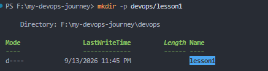
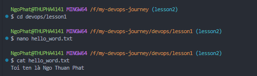

# Bài tập buổi 2: Thực hành các lệnh Linux cơ bản

## 1. Các bước thực hiện

1. **Tạo thư mục và di chuyển vào thư mục:**
   ```bash
   mkdir -p devops/lesson1
   cd devops/lesson1
   ```

2. **Tạo file `hello_word.txt`:**
   ```bash
   touch hello_word.txt
   ```

3. **Soạn thảo nội dung bằng `nano` hoặc `echo`:**
   ```bash
   nano hello_word.txt
   ```
   *(Có thể nhập nội dung và lưu lại theo cách thủ công hoặc dùng lệnh `echo` để tạo file nhanh hơn)*

4. **Hiển thị nội dung file:**
   ```bash
   cat hello_word.txt
   ```

---

## 2. Kết quả thực thi trên Terminal

```text
PS F:\my-devops-journey> cd devops/lesson1
PS F:\my-devops-journey\devops\lesson1> ls
Mode                 LastWriteTime         Length Name
----                 -------------         ------ ----
d----        9/13/2026   11:45 PM                lesson1

PS F:\my-devops-journey\devops\lesson1> nano hello_word.txt

PS F:\my-devops-journey\devops\lesson1> cat hello_word.txt
Toi ten la Ngo Thuan Phat
```

## 3. Hình ảnh minh họa



