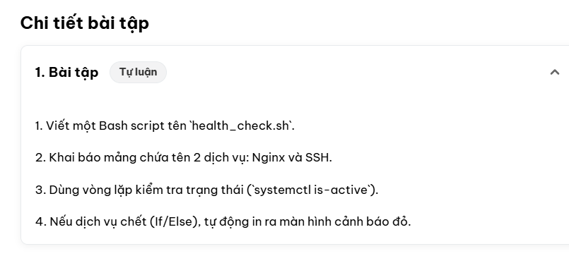

# Bài tập buổi 3: Viết Bash script `health_check.sh` kiểm tra dịch vụ

## 1. Yêu cầu bài tập

1. Viết một Bash script tên `health_check.sh`.
2. Khai báo mảng chứa tên 2 dịch vụ: **Nginx** và **SSH**.
3. Dùng vòng lặp kiểm tra trạng thái (`systemctl is-active`).
4. Nếu dịch vụ chết (If/Else), tự động in ra màn hình cảnh báo.



---

## 2. Các bước thực hiện

1. **Tạo thư mục bài học và di chuyển vào thư mục:**

   ```bash
   mkdir -p devops/lesson3
   cd devops/lesson3
   ```

2. **Tạo file script và cấp quyền thực thi:**

   ```bash
   touch health_check.sh
   chmod +x health_check.sh
   ```

3. **Khai báo mảng 2 dịch vụ cần kiểm tra:**

   ```bash
   SERVICES=("nginx" "ssh")
   ```

4. **Dùng vòng lặp + If/Else để kiểm tra từng dịch vụ:**

   ```bash
   for service in "${SERVICES[@]}"; do
     if systemctl is-active --quiet "$service"; then
       echo "[ OK ] $service đang chạy"
     else
       echo "[WARN] $service KHÔNG chạy (đã chết hoặc chưa được cài đặt)!"
     fi
   done
   ```

5. **Chạy script:**

   ```bash
   ./health_check.sh
   ```

---

## 3. Kết quả thực thi

```text
=== HEALTH CHECK 2026-09-18 11:42:18 ===
[ OK ]   nginx đang chạy
[WARN]   ssh KHÔNG chạy (đã chết hoặc chưa được cài đặt)!
         >>> CẢNH BÁO: dịch vụ 'ssh' cần được kiểm tra ngay! <<<
         Trạng thái: không xác định
---------------------------------------
Cảnh báo: 1/2 dịch vụ gặp sự cố: ssh
```

*(Kết quả trên được kiểm thử bằng cách giả lập lệnh `systemctl`: `nginx` trả về "đang chạy", `ssh` trả về "chết".)*

---

## 4. Giải thích & lưu ý

| Thành phần | Ý nghĩa |
| --- | --- |
| `SERVICES=("nginx" "ssh")` | Mảng (array) chứa tên các dịch vụ cần kiểm tra |
| `"${SERVICES[@]}"` | Duyệt toàn bộ phần tử trong mảng, giữ nguyên từng phần tử |
| `systemctl is-active --quiet` | Trả về mã thoát `0` nếu dịch vụ đang chạy, khác `0` nếu không |
| `if / else` | Rẽ nhánh: dịch vụ sống thì báo OK, chết thì in cảnh báo |
| Màu đỏ `\033[1;31m` | Chỉ bật khi đầu ra là terminal, để log ghi ra file vẫn sạch |

**Mã thoát (exit code) của script:**

- `0` = tất cả dịch vụ đều đang chạy
- `1` = có ít nhất một dịch vụ đã chết
- `2` = máy không dùng `systemd` (không có lệnh `systemctl`)

**Lưu ý về tên dịch vụ SSH:**

- Ubuntu / Debian: dịch vụ tên là `ssh`
- CentOS / RHEL / AlmaLinux: dịch vụ tên là `sshd`

Tùy hệ điều hành mà sửa lại mảng cho đúng:

```bash
SERVICES=("nginx" "sshd")
```

Vì script trả về mã thoát khác `0` khi có dịch vụ chết, ta có thể dùng nó trong `cron` để giám sát định kỳ:

```bash
# Kiểm tra mỗi 5 phút, ghi log lại
*/5 * * * * /path/to/health_check.sh >> /var/log/health_check.log 2>&1
```
